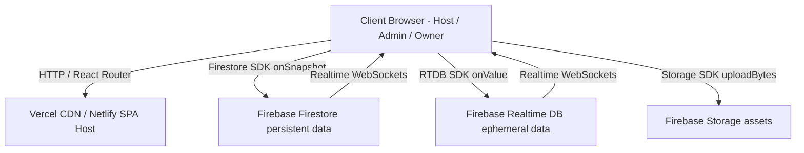

# 📄 Product Requirement Document (PRD)

## 📌 Project Title
**Real-Time IPL-Style Live Cricket Auction Platform**

---

## 1. Executive Summary & Product Vision

### 1.1 Summary
The Real-Time Live Cricket Auction Platform is a web-based, multi-device software system designed to replicate the excitement and strategic depth of professional T20 franchise auctions (e.g., IPL). The platform allows tournament administrators, auctioneers, and team owners to conduct live auctions with real-time bidding synchronization across physical devices, automated rule enforcement, and live broadcast visuals.

### 1.2 Product Vision
To provide sports clubs, tournament organizers, and gaming enthusiasts with a seamless, broadcast-ready digital auction hub that operates with zero latency, zero bidding conflicts, and automated roster and budget enforcement.

---

## 2. Target Audience & User Personas

| Role | User Persona | Core Goal | Primary Actions |
| :--- | :--- | :--- | :--- |
| **Admin** | Tournament Administrator | Setup auction data & parameters | Register teams, set budgets, add/import players, manage player pool |
| **Host** | Professional Auctioneer | Control auction flow & finalize deals | Bring players under hammer, trigger SOLD / UNSOLD decisions, manage unsold queue |
| **Owner** | Franchise Team Owner | Build optimal squad within budget | Bid on active players, monitor remaining purse, inspect categorized squad roster |
| **Guest / Spectator** | Fan / Viewer | Watch auction live | View live standings ticker, active hammer player, current bids |

---

## 3. Functional Requirements

### 3.1 Authentication & Role-Based Access Control (RBAC)
- **FR-AUTH-1**: The system MUST enforce role selection upon entering protected routes (`/admin`, `/host`, `/owner`).
- **FR-AUTH-2**: Access to `/admin` MUST require Admin Security PIN `1234`.
- **FR-AUTH-3**: Access to `/host` MUST require Host Security PIN `5678`.
- **FR-AUTH-4**: Access to `/owner` MUST require selecting a valid Franchise Team from Firestore.
- **FR-AUTH-5**: The system MUST store role credentials in tab-isolated `sessionStorage` (`ca_user_role`, `ca_user_team_id`, `ca_user_team_name`), enabling multiple browser tabs on one PC to represent distinct franchise teams independently.
- **FR-AUTH-6**: Unauthorized routing attempts MUST be intercepted by `ProtectedRoute` and redirected to `/login` or `/unauthorized`.

### 3.2 Admin Console (`/admin`)
- **FR-ADM-1 (Team Setup)**: Admin MUST be able to create franchise teams specifying Name, Total Budget in Crores (INR), Max Squad Size (default 25), and upload a custom logo or provide an image URL.
- **FR-ADM-2 (Player Setup)**: Admin MUST be able to create players specifying Full Name, Role (*Batter*, *Bowler*, *All-Rounder*, *Wicket Keeper*), Nationality (*Domestic*, *Overseas*), Base Price in Lakhs (INR), and upload a photo file or provide an image URL.
- **FR-ADM-3 (Live Cricket API)**: Admin MUST be able to click **"Fetch & Import Live API Players"** to automatically pull real-time cricket player data from CricAPI / CricketData.org into Firestore.
- **FR-ADM-4 (Quick Auto-Seed)**: Admin MUST be able to click **"Quick Auto-Seed"** to populate preset IPL teams (CSK, MI, RCB, KKR) and star player profiles in 1 click.
- **FR-ADM-5 (Pool Management)**: Admin MUST be able to view real-time lists of registered teams and players, with filter tabs (*all*, *upcoming*, *sold*, *unsold*) and deletion capabilities.

### 3.3 Host Auctioneer Desk (`/host`)
- **FR-HST-1 (Live Hammer Control)**: Host MUST be able to bring the next player from the upcoming queue to the live hammer stage in 1 click.
- **FR-HST-2 (Atomic Sale Transaction)**: When selling a player, the system MUST execute an atomic transaction (`runTransaction`) that:
  - Updates player status to `sold`, saving `sold_to_team_id` and `sold_price`.
  - Deducts `sold_price` from the winning team's `current_purse`.
  - Increments winning team's `squad_count` by 1.
  - Increments winning team's `overseas_count` by 1 if `nationality === 'Overseas'`.
  - Resets live auction stage across all connected clients.
- **FR-HST-3 (Mark Unsold)**: Host MUST be able to mark a player as `unsold` if no bids are placed, moving them to the Unsold Queue.
- **FR-HST-4 (Unsold Recall Queue)**: Host MUST be able to view all unsold players and click **"Recall to Auction"** to reset their status to `upcoming` for a re-auction.
- **FR-HST-5 (Live Franchise Dashboard)**: Host MUST see real-time standing cards for all teams, including animated budget utilization progress bars, squad filling rates, and overseas quota counters.

### 3.4 Team Owner Bidding Console (`/owner`)
- **FR-OWN-1 (Real-Time Bidding Stage)**: Owner MUST see live updates of the active player under the hammer, including photo, role, nationality badge, base price, current highest bid amount, and highest bidder team name.
- **FR-OWN-2 (Dynamic Quick Bids)**: Owner MUST be provided with 1-click Quick Bid increment buttons (`+ ₹20 Lakhs`, `+ ₹50 Lakhs`, `+ ₹1 Crore`) pre-calculated from the current bid.
- **FR-OWN-3 (Custom Bidding)**: Owner MUST be provided with a custom bid input field accepting amounts in Lakhs.
- **FR-OWN-4 (My Squad Roster)**: Owner MUST see a live synchronized list of all players purchased by their team, categorized into tabs (*All*, *Batters*, *Bowlers*, *All-Rounders*, *Keepers*), showing winning prices paid and total team expenditure.

---

## 4. Strict Business Rules & Validation Engine

| Rule ID | Rule Name | Description | Rejection Response |
| :--- | :--- | :--- | :--- |
| **BR-0** | Self-Bidding Prevention | A team cannot bid if they currently hold `highest_bidder_team_id`. | *"Your team already holds the highest bid!"* |
| **BR-1** | Opening & Increment Check | Opening bid `>= base_price`. Subsequent bids `> current_bid`. | *"Bid must be strictly higher than current bid!"* |
| **BR-2** | Budget Limit | Proposed `bid_amount <= team.current_purse`. | *"Purse exceeded: Bid exceeds remaining budget!"* |
| **BR-3** | Squad Capacity Limit | `team.squad_count < team.max_squad_size` (Max 25). | *"Squad full: Team has reached max capacity!"* |
| **BR-4** | Overseas Quota Limit | If `player.nationality === 'Overseas'`, `team.overseas_count < 8`. | *"Overseas limit reached: Max 8 overseas players!"* |

---

## 5. System Architecture & Technical Specifications



### 5.1 Architecture Stack
- **Frontend**: React 18, Vite 5, Tailwind CSS, Lucide React Icons, React Router v6.
- **Backend / Database**:
  - **Firebase Firestore**: Stores `teams`, `players`, and fallback `live_auction` documents.
  - **Firebase Realtime Database (RTDB)**: Ephemeral WebSocket state synchronization for sub-second rapid live bids.
  - **Firebase Storage**: Stores uploaded image binaries for player photos and team logos.
  - **Firebase Auth**: Anonymous Authentication provider.

### 5.2 Dual-Sync Realtime Bidding & LWW CRDT Resolution
- To guarantee 100% reliability regardless of individual network conditions or RTDB console setup status, the system implements **Dual-Sync Architecture**.
- Every auction action updates **both** Firestore (`doc(db, 'live_auction', 'current')`) and RTDB (`ref(rtdb, 'live_auction')`).
- State updates are processed using a **Last-Write-Wins (LWW) CRDT resolver** with Unix epoch millisecond timestamps (`timestamp: Date.now()`). Snapshots with older timestamps are discarded, preventing stale caches from locking bid controls.

---

## 6. Non-Functional Requirements

### 6.1 Performance
- **Latency**: Real-time bid propagation across all connected devices MUST complete in `< 100ms`.
- **Build Output**: Production bundle MUST compile cleanly using Vite ES modules.

### 6.2 Availability & Resilience
- **Offline & Reconnection**: The application MUST automatically reconnect to Firebase sockets upon temporary network drop.
- **SPA Routing**: The deployment MUST include SPA rewrite rules (`public/_redirects` and `vercel.json`) so direct page reloads on `/admin`, `/host`, or `/owner` resolve without 404 errors.

### 6.3 Security
- **Public Hosting Visibility**: Deployment Protection MUST be set to Public for unrestricted multi-device participation.
- **Input Sanitization**: Numeric inputs MUST be validated and parsed before calculation to prevent `NaN` crashes.

---

## 7. UI/UX & Design System

- **Color Palette**: Dark sports broadcast theme (`slate-950` background, `slate-900` glass panels, `amber-400` gold accents, `emerald-400` money highlights, `cyan-400` API highlights).
- **Typography**: Sans-serif interface typography with high-contrast `font-mono` for financial numbers and monetary values.
- **Micro-Animations**: Pulse indicators for live broadcast rooms, hover transitions on bidding buttons, toast notification slide-ins.

---

## 8. Deployment & CI/CD Pipeline

1. **Source Control**: Managed on GitHub at `https://github.com/bhamaresarthak42/CricketAuction.git`.
2. **Automated CI/CD**: Connected to Vercel via GitHub webhooks on the `main` branch.
3. **Deployment Flow**:
   ```bash
   git add .
   git commit -m "Feature or fix description"
   git push origin main
   ```
   *Vercel automatically triggers a build and deploys changes to the live URL within 30 seconds.*

---

## 9. Future Scope & Enhancement Roadmap

- **Version 2.0**: Team owner audio-visual buzzers for instant live auction room audio cues.
- **Version 2.1**: PDF report export for final team squads and auction summary statements.
- **Version 2.2**: Multi-league tournament support (WPL, BBL, CPL pre-configured rulesets).
